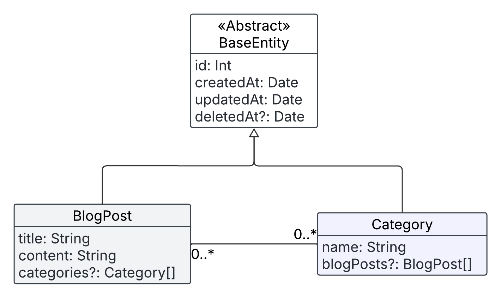
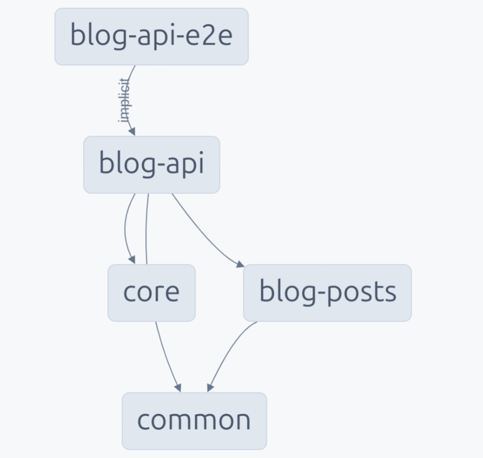

# Blog Platform

## Description

This is a simple backend for a blog platform built with **Nx**, **NestJS**, **TypeORM**, **PostgreSQL**, and **GraphQL**. It supports full **CRUD** operations on blog posts, with **real-time updates** via GraphQL subscriptions for newly created blog posts. The project follows a modular architecture using Nx-recommended structure and includes proper error handling, logging, and efficient data fetching.

## Key Dependencies
* `@nestjs/graphql` — Integrates GraphQL into the NestJS application.
* `@nestjs/typeorm` — TypeORM integration for working with PostgreSQL.
* `pg` — PostgreSQL driver for Node.js.
* `apollo-server-express` — Apollo server middleware for GraphQL.
* `graphql-subscriptions` and `subscriptions-transport-ws` — Real-time functionality using WebSocket-based GraphQL subscriptions.
* `dataloader` — Efficient batching and caching of GraphQL resolvers to eliminate the N+1 query problem.
* `class-validator`, `class-transformer` — Used for input validation and transformation.
* `joi` — Schema-based environment variable validation.
* `@nx/*` — Nx workspace libraries for tooling and development experience.

## How to Run the Project
For complete setup and running instructions (with and without Docker), see [this document](docs/RUNNING.md).

## Technical Details

### Entities Diagram




The core entity is `BlogPost`, which has a many-to-many relationship with `Category`.

### API Reference

GraphQL Playground provides an **interactive, auto‑generated API reference and schema documentation** that’s always kept in sync with the code. You can explore and try out queries, mutations, and subscriptions in the Playground UI:
> http://localhost:3000/graphql

For a **static overview**, see [API Reference](docs/API_REFERENCE.md).

### GraphQL Operations Examples

You can test out GraphQL queries, mutations, and subscriptions using the sample operations in [GraphQL Examples](docs/GRAPHQL_EXAMPLES.md).


### Project Structure

```
apps/
  blog-api/         # Main NestJS application
libs/
  blog-posts/
  common/
  core/
```
##### Library Breakdown:
* **core**:  configures essential services including environment settings, database connections, and GraphQL setup.
* **blog-posts**: Implements the complete domain functionality for blog posts.
* **common**: Provides reusable components like base entities, exception filters, logging utilities...

##### NX Dependencies Graph:



### Other Technical Details

* **DataLoader**: Used to efficiently resolve `Category` relationships in posts and avoid $N+1$ problems.
